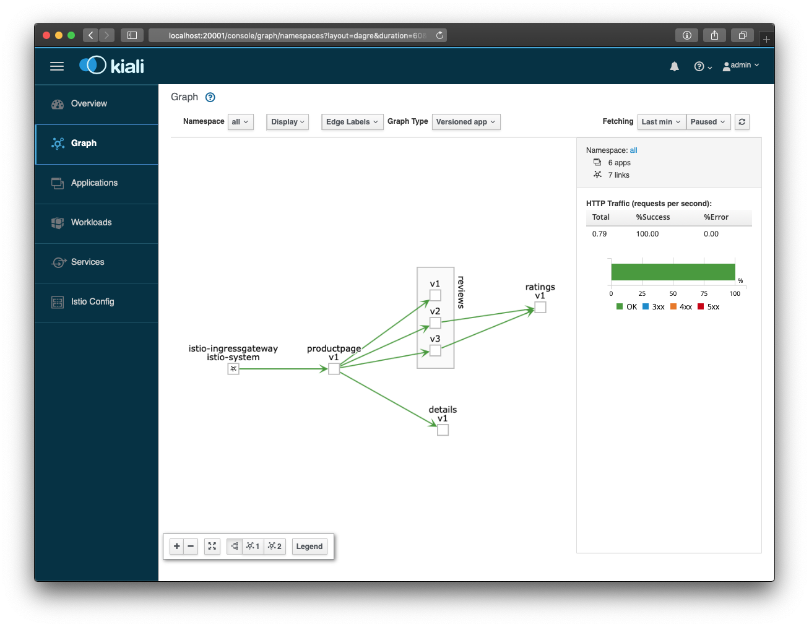

:toc:
= Istio with Kubernetes on AWS

This repo shows how to get https://istio.io/docs/examples/bookinfo/[Istio BookInfo sample] running on a Kubernetes cluster on AWS. We'll use http://aws.amazon.com/eks[Amazon EKS] for the Kubernetes cluster. This is tested with https://github.com/istio/istio/releases/tag/1.0.2[Istio 1.0.2].

== Kubernetes Cluster on AWS

. Create Amazon EKS cluster using https://eksctl.io/[eksctl] CLI:

	brew install weaveworks/tap/eksctl
	eksctl create cluster istio-eks --nodes 4

== Install and Configure Istio

. Download:

	curl -L https://github.com/istio/istio/releases/download/1.0.5/istio-1.0.5-osx.tar.gz | tar xzvf -
	cd istio-1.0.5
	export PATH=$PWD/bin:$PATH

. Install Helm:

	kubectl create -f install/kubernetes/helm/helm-service-account.yaml
	helm init --service-account tiller

. Install:

	helm install \
		--wait \
		--name istio \
		--namespace istio-system \
		install/kubernetes/helm/istio \
		--set tracing.enabled=true \
		--set kiali.enabled=true \
		--set grafana.enabled=true

NOTE: If that step fails with "can not find tiller", check if you have a pre-existing ~/.helm directory from a
a previous run. In that case you can try to remove it and run `helm init` from the previous step again.

. Verify services:

	kubectl get pods -n istio-system
	TODO

. Enable Istio on `default` namespace:

	kubectl label namespace default istio-injection=enabled

== BookInfo

=== Deploy BookInfo

Read details about https://istio.io/docs/guides/bookinfo/[BookInfo application].

. Deploy the application with automatic sidecar injection for each pod:

	kubectl apply -f samples/bookinfo/platform/kube/bookinfo.yaml

. Verify services:

	kubectl get svc

. Verify pods:

	kubectl get pods

=== Define Ingress

. Define the ingress gateway for the application:

	kubectl apply -f samples/bookinfo/networking/bookinfo-gateway.yaml

. Confirm gateway:

	kubectl get gateway
	TODO

=== Access Application

. Define environment variables:

	export INGRESS_HOST=$(kubectl -n istio-system get service istio-ingressgateway -o jsonpath='{.status.loadBalancer.ingress[0].hostname}')
	export INGRESS_PORT=$(kubectl -n istio-system get service istio-ingressgateway -o jsonpath='{.spec.ports[?(@.name=="http")].port}')
	export SECURE_INGRESS_PORT=$(kubectl -n istio-system get service istio-ingressgateway -o jsonpath='{.spec.ports[?(@.name=="https")].port}')
	export GATEWAY_URL=$INGRESS_HOST:$INGRESS_PORT

. Access the application:

	echo "Accessing bookinfo at http://${GATEWAY_URL}/productpage"
	open http://${GATEWAY_URL}/productpage    # Open browser, OS/X only. 

This will show the output:

`reviews` service has 3 versions and so the output page will look diffeent with each refresh.

=== Visualise topology and traffic with Kiali

https://www.kiali.io/[Kiali] is a UI for Istio that can dynamically show the mesh topology and traffic flows. Using Kiali will help you understanding the routing rules we are going to apply in the next section.

. Accessing Kiali

We use Kubernetes port forwarding to access Kiali via tunnel to our local host

	kubectl -n istio-system port-forward svc/kiali 20001:20001 &
	open http://localhost:20001/console/      # Open Kiali in browser, OS/X only. 
	
Use _admin_/_admin_ as username/password. Once logged in, click on _Graph_ in the left navigation.

This will then show the graph like the following. Hit the bookinfo a few times to see how the traffic is visualised

=== Apply default destination rules

. Define the destination rules:

	kubectl apply -f samples/bookinfo/networking/destination-rule-all.yaml

. Verify:

	kubectl get destinationrules -o yaml

== Intelligent Routing

This section demonstrates how to use various traffic management capabilities of Istio. All details at https://istio.io/docs/examples/intelligent-routing/.

=== Request Routing

. Route all traffic to `v1` of each microservice:

	kubectl apply -f samples/bookinfo/networking/virtual-service-all-v1.yaml

. Refresh http://$GATEWAY_URL/productpage. Multiple refereshes of the page now shows output from the same `reviews` service (no rating stars).
. Route all traffic based on user identity:

	kubectl apply -f samples/bookinfo/networking/virtual-service-reviews-test-v2.yaml

. On the `/productpage`, log in as user `jason`, no password. `end-user: jason` is sent as an HTTP header. `VirtualService` is configured to send traffic to `v2` if `end-user: jason` is included in the HTTP request header. Otherwise traffic is sent to `v1`.
. Refresh the browser and star ratings appear next to each review.
. Log out and log in as any other user. Refresh the browser and the stars disappear again.

=== Fault Injection

==== Injecting an HTTP Delay Fault

. Create a 7s delay between `reviews:v2` and `ratings` microservice for user `jason`:

	kubectl apply -f samples/bookinfo/networking/virtual-service-ratings-test-delay.yaml

. On the `/productpage`, log in as user `jason`:
+
image::images/TODO.png[]
+
This occurs because `productpage` to `reviews` is 6s total - 3s with + 1 retry. So `/productpage` times out prematurely and throws the error.
. Fix is already available in `v3`. Migrate all the traffic to `v3`:

	kubectl apply -f samples/bookinfo/networking/virtual-service-reviews-v3.yaml

==== Injecting an HTTP Abort Fault

Introduce HTTP abort to the `ratings` microservices for the test user `jason`.

. Create an injection fault rule:

	kubectl apply -f samples/bookinfo/networking/virtual-service-ratings-test-abort.yaml

. On `/productpage`, log in as user `jason` to see the following output:
+
image::images/TODO.png[]
+
. Log out from user `jason` and the rating stars show up:
+
image::images/TODO.png[]

==== Cleanup

=== Traffic Shifting

. Transfer 50% of the traffic from `reviews:v1` to `reviews:v3`:

	kubectl apply -f samples/bookinfo/networking/virtual-service-reviews-50-v3.yaml

. Refresh the `/productpage` in your browser and you now see red colored star ratings approximately 50% of the time.
. Route 100% of the traffic to reviews:v3 by applying this virtual service:

	kubectl apply -f samples/bookinfo/networking/virtual-service-reviews-v3.yaml

. Refresh the `/productpage` in your browser and you now see red colored star ratings for each review.

=== Setting Request Timeouts

=== Control Ingress Traffic

This section explains how to configure Istio to expose a service outside of the service mesh using an Istio Gateway instead of the usual Kubernetes Ingress Resource.

. Deploy `httpbin` sample:

	kubectl apply -f samples/httpbin/httpbin.yaml

. Determine IP ingress and ports:

	export INGRESS_HOST=$(kubectl -n istio-system get service istio-ingressgateway -o jsonpath='{.status.loadBalancer.ingress[0].hostname}')
	export INGRESS_PORT=$(kubectl -n istio-system get service istio-ingressgateway -o jsonpath='{.spec.ports[?(@.name=="http2")].port}')
	export SECURE_INGRESS_PORT=$(kubectl -n istio-system get service istio-ingressgateway -o jsonpath='{.spec.ports[?(@.name=="https")].port}')

. Create an Istio Gateway:

	kubectl apply -f httpbin-ingress-gateway.yaml

. Configure routes for the gateway:

	kubectl apply -f httpbin-virtualservice.yaml

. Access the `httpbin` service using curl:

	curl -I -HHost:httpbin.example.com http://$INGRESS_HOST:$INGRESS_PORT/status/200
	TODO

. Access any other URL:

	curl -I -HHost:httpbin.example.com http://$INGRESS_HOST:$INGRESS_PORT/headers

. Enable a wildcard `*` value for the host in Gateway:

	kubectl apply -f httpbin-ingress-browser.yaml

. Access $INGRESS_HOST:$INGRESS_PORT/headers in the browser.
. Clean up:

	kubectl delete gateway httpbin-gateway
	kubectl delete virtualservice httpbin
	kubectl delete --ignore-not-found=true -f samples/httpbin/httpbin.yaml

=== Securing Gateways with HTTPS

. Generate certificates, select `y` for all the questions:

	git clone https://github.com/nicholasjackson/mtls-go-example
	cd mtls-go-example
	./generate.sh httpbin.example.com abc123
	mkdir ~/httpbin.example.com
	mv 1_root 2_intermediate 3_application 4_client ~/httpbin.example.com

. Create a Kubernetes Secret to hold the server’s certificate and private key:

	kubectl create -n istio-system secret tls istio-ingressgateway-certs --key httpbin.example.com/3_application/private/httpbin.example.com.key.pem --cert ~/httpbin.example.com/3_application/certs/httpbin.example.com.cert.pem

. Define a Gateway with a server section for port 443:

	kubectl apply -f httpbin-gateway-server-cert.yaml

. Configure routes for traffic entering via the Gateway:

	kubectl apply -f httpbin-virtualservice-https.yaml

. Access the `httpbin` service with HTTPS by sending an https request using curl to `$SECURE_INGRESS_PORT`:

	curl -v -HHost:httpbin.example.com --resolve httpbin.example.com:$SECURE_INGRESS_PORT:$INGRESS_HOST --cacert ~/httpbin.example.com/2_intermediate/certs/ca-chain.cert.pem https://httpbin.example.com:$SECURE_INGRESS_PORT/status/418

=== Control Egress Traffic

By default, Istio-enabled services cannot access URLs outside of the cluster. This section will explain how to configure Istio using `ServiceEntry` to expose external services to Istio-enabled clients. Specifically, the service will access httpbin.org.

. Deploy `sleep` sample:

	kubectl apply -f samples/sleep/sleep.yaml

. Create a `ServiceEntry` to allow access to an external HTTP service:

	kubectl apply -f httpbin-serviceentry.yaml

. Create a `ServiceEntry` and `VirtualService` to allow access to an external HTTPS service:

	kubectl apply -f httpbin-serviceentry-https.yaml

. Exec into the pod:

	export SOURCE_POD=$(kubectl get pod -l app=sleep -o jsonpath={.items..metadata.name})
	kubectl exec -it $SOURCE_POD -c sleep bash

. Make a request to the external HTTP service:

	curl http://httpbin.org/headers

. Make a request to the external HTTPS service:

	curl https://www.google.com

=== Circuit Breaking

This sections shows how to configure circuit breaking for connections, requests, and outlier detection.

. Create a destination rule to apply circuit breaking. These rules allow only one connection and request concurrently, anything more will trip the circuit:

	kubectl apply -f httpbin-circuitbreaker.yaml

. Create the client:

	kubectl apply -f samples/httpbin/sample-client/fortio-deploy.yaml

. Make a successful request:

	FORTIO_POD=$(kubectl get pod | grep fortio | awk '{ print $1 }')
	kubectl exec -it $FORTIO_POD  -c fortio /usr/local/bin/fortio -- load -curl  http://httpbin:8000/get

. Call the service with two concurrent connections and send 20 requests:

	kubectl exec -it $FORTIO_POD -c fortio /usr/local/bin/fortio -- load -c 2 -qps 0 -n 20 -loglevel Warning http://httpbin:8000/get

. Increase the number of concurrent requests to 3:

	kubectl exec -it $FORTIO_POD  -c fortio /usr/local/bin/fortio -- load -c 3 -qps 0 -n 20 -loglevel Warning http://httpbin:8000/get

. Query `istio-proxy` to see stats:

	kubectl exec -it $FORTIO_POD  -c istio-proxy  -- sh -c 'curl localhost:15000/stats' | grep httpbin | grep pending

=== Mirroring

. Deploy two versions of `httpbin` Deployment and one Service:

	kubectl apply -f httpbin-mirroring-v1.yaml
	kubectl apply -f httpbin-mirroring-v2.yaml
	kubectl apply -f httpbin-mirroring-service.yaml

. Start `sleep` service to generate load:

	kubectl apply -f httpbin-mirroring-client.yaml

. Route all traffic to `v1`:

	kubectl apply -f httpbin-mirroring-v1-route.yaml

. Send traffic to the service:

	export SLEEP_POD=$(kubectl get pod -l app=sleep -o jsonpath={.items..metadata.name})
	kubectl exec -it $SLEEP_POD -c sleep -- sh -c 'curl  http://httpbin:8080/headers' | python -m json.tool

. Check the logs for `v1` and `v2`. There should be log entries for `v1` and none for `v2`:

	export V1_POD=$(kubectl get pod -l app=httpbin,version=v1 -o jsonpath={.items..metadata.name})
	kubectl logs -f $V1_POD -c httpbin
	export V2_POD=$(kubectl get pod -l app=httpbin,version=v2 -o jsonpath={.items..metadata.name})
	kubectl logs -f $V2_POD -c httpbin

. Mirror traffic to `v2`:

	kubectl apply -f httpbin-mirroring-to-v2.yaml

. Send in traffic:

	kubectl exec -it $SLEEP_POD -c sleep -- sh -c 'curl  http://httpbin:8080/headers' | python -m json.tool

. Check the logs in `v1` and `v2`:

	kubectl logs -f $V1_POD -c httpbin
	kubectl logs -f $V2_POD -c httpbin

== Security

This section demonstrates how to secure Istio. All details at https://istio.io/docs/tasks/security/.

=== Authentication Policy

=== Mutual TLS

=== Authorization

=== Plugging-in External CA Key and Certificate

=== Citadel Health Checking

=== Mutual TLS Migration

=== Mutual TLS over HTTPS

== Policies

All details at https://istio.io/docs/tasks/policy-enforcement/.

=== Enabling Rate Limits

=== Denials and White/Black Listing

== Telemetry

This section demonstrates how to obtain uniform metrics, logs, traces across different services. All details at https://istio.io/docs/examples/telemetry/.

=== Distributed Tracing

=== Collecting Metrics and Logs

=== Collecting Metrics for TCP Services

=== Querying Metrics from Prometheus

=== Visualizing Metrics with Grafana

=== Generating a Service Graph

=== Logging with Fluentd

== Canary Deployment

Details at https://istio.io/blog/2017/0.1-canary/.

== Cleanup

. Delete routing rules and terminate application pods:

	samples/bookinfo/platform/kube/cleanup.sh

