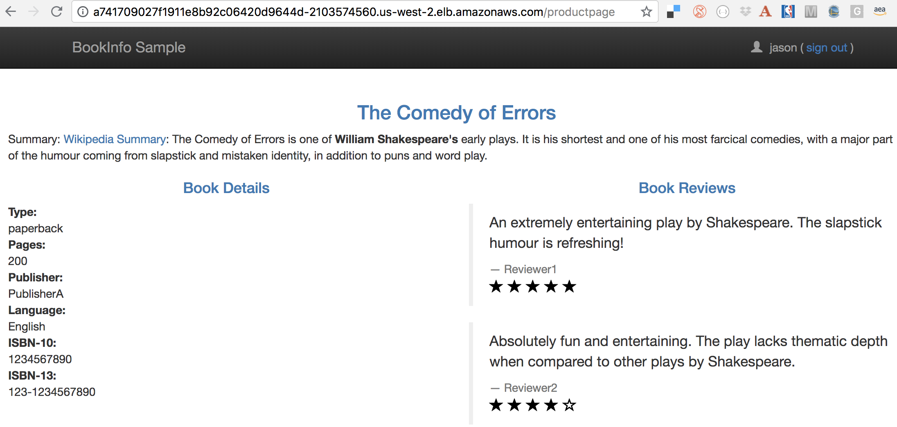
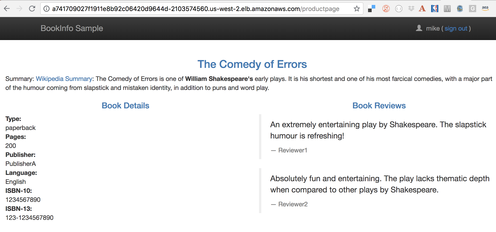

:toc:
= Istio with Kubernetes on AWS

This repo shows how to get Istio BookInfo sample running on a Kubernetes cluster on AWS. This is tested with Istio 0.8.

== Kubernetes Cluster on AWS

=== EKS

https://docs.aws.amazon.com/eks/latest/userguide/getting-started.html

=== kops

https://github.com/kubernetes/kops[kops] is a commmunity-supported way to get a Kubernetes cluster up and running on AWS.

. Set AZs:

	export AWS_AVAILABILITY_ZONES="$(aws ec2 describe-availability-zones \
		--query 'AvailabilityZones[].ZoneName' \
		--output text | \
		awk -v OFS="," '$1=$1')"

. Set state store: `export KOPS_STATE_STORE=s3://kubernetes-aws-io`
. Create cluster:

	kops create cluster \
		--zones ${AWS_AVAILABILITY_ZONES} \
		--master-count 1 \
		--master-size m4.xlarge \
		--node-count 3 \
		--node-size m4.2xlarge \
		--name cluster.k8s.local \

. Edit cluster to enable admission controllers:

    kops edit cluster --name cluster.k8s.local

. Add the following in the configuration file:

    kubeAPIServer:
      admissionControl:
      - NamespaceLifecycle
      - LimitRanger
      - ServiceAccount
      - PersistentVolumeLabel
      - DefaultStorageClass
      - DefaultTolerationSeconds
      - MutatingAdmissionWebhook
      - ValidatingAdmissionWebhook
      - ResourceQuota
      - NodeRestriction
      - Priority

. Update the cluster:

   kops update cluster --yes

== Install and Configure Istio

. Install and configure:

	curl -L https://github.com/istio/istio/releases/download/0.8.0/istio-0.8.0-osx.tar.gz | tar xzvf -
	cd istio-0.8.0
	export PATH=$PWD/bin:$PATH
	kubectl apply -f install/kubernetes/istio-demo.yaml

. Verify:

	kubectl get pods -n istio-system
	NAME                                        READY     STATUS      RESTARTS   AGE
	grafana-cd99bf478-59qmx                     1/1       Running     0          4m
	istio-citadel-ff5696f6f-zkpzt               1/1       Running     0          4m
	istio-cleanup-old-ca-6nmrg                  0/1       Completed   0          4m
	istio-egressgateway-58d98d898c-bjd4f        1/1       Running     0          4m
	istio-ingressgateway-6bc7c7c4bc-sc7s6       1/1       Running     0          4m
	istio-mixer-post-install-g67rd              0/1       Completed   0          4m
	istio-pilot-6c5c6b586c-nfwt9                2/2       Running     0          4m
	istio-policy-5c7fbb4b9f-f2xtn               2/2       Running     0          4m
	istio-sidecar-injector-dbd67c88d-j8882      1/1       Running     0          4m
	istio-statsd-prom-bridge-6dbb7dcc7f-ms846   1/1       Running     0          4m
	istio-telemetry-54b5bf4847-nlqjx            2/2       Running     0          4m
	istio-tracing-67dbb5b89f-9zd5j              1/1       Running     0          4m
	prometheus-586d95b8d9-mz9bm                 1/1       Running     0          4m
	servicegraph-6d86dfc6cb-tbwwt               1/1       Running     0          4m

== Deploy BookInfo 

Read details about https://istio.io/docs/guides/bookinfo/[BookInfo application].

. Deploy the application with manual sidecar injection for each pod:

	kubectl apply -f <(istioctl kube-inject -f samples/bookinfo/kube/bookinfo.yaml)

. Define the ingress for each application:

	istioctl create -f samples/bookinfo/routing/bookinfo-gateway.yaml

. Define environment variables:

	export INGRESS_HOST=$(kubectl -n istio-system get service istio-ingressgateway -o jsonpath='{.status.loadBalancer.ingress[0].hostname}')
	export INGRESS_PORT=$(kubectl -n istio-system get service istio-ingressgateway -o jsonpath='{.spec.ports[?(@.name=="http")].port}')
	export SECURE_INGRESS_PORT=$(kubectl -n istio-system get service istio-ingressgateway -o jsonpath='{.spec.ports[?(@.name=="https")].port}')
	export GATEWAY_URL=$INGRESS_HOST:$INGRESS_PORT

. Access the application:

	open http://${GATEWAY_URL}/productpage
+
This will show the output:
+
image:images/bookinfo1.png[]
+
`reviews` service has 3 versions and so the output page will look diffeent with each refresh.

== Content-based Routing

Complete details at https://istio.io/docs/tasks/traffic-management/request-routing/.

. Set the default version of `reviews` service to v1:
+
	kubectl apply -f samples/bookinfo/routing/route-rule-all-v1.yaml
+
Multiple refereshes of the page now shows output from the same `reviews` service (no rating stars).
+
. Guide a specific user to `reviews:v2`:

	istioctl replace -f samples/bookinfo/routing/route-rule-reviews-test-v2.yaml

. Click on `Sign In` on top left, give `jason` as `User Name`, no password. The output page is refreshed:
+

+
Click on `sign out`, `Sign In` again using `mike` and see the output:
+

+
. Remove the rule:

	istioctl delete -f samples/bookinfo/routing/route-rule-all-v1.yaml
